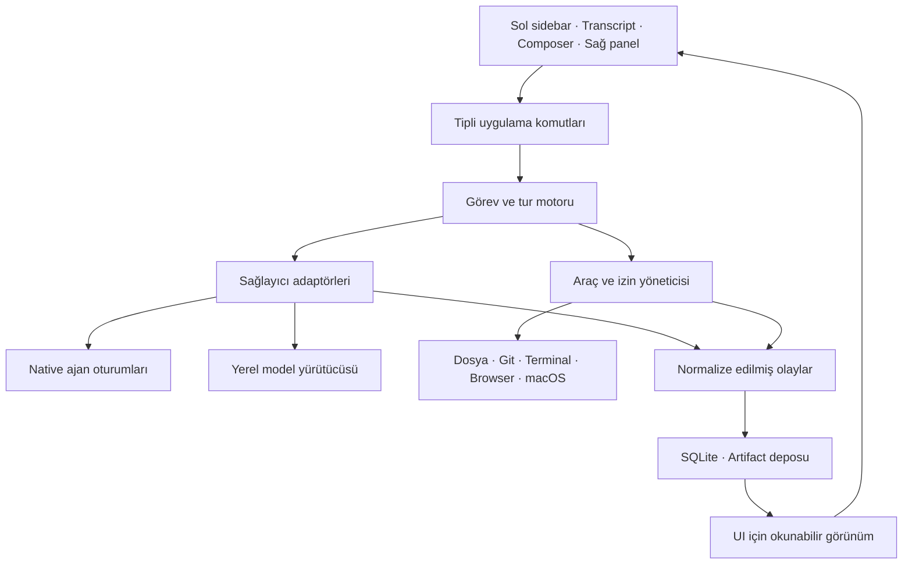

# Akorith yeniden yapım planı

Tarih: 4 Eylül 2026 · Durum: uygulamaya geçmeden önceki ayrıntılı tasarım planı.

Bu planın kanıt temeli [AUDIT.md](AUDIT.md), davranış kapıları [ACCEPTANCE_MATRIX.md](ACCEPTANCE_MATRIX.md) dosyasındadır. Kaynak incelemesi ile öneriler birbirinden ayrılmıştır. Bu belge bir tamamlanma raporu değildir.

## 1. Ürün kararı

Akorith, kullanıcının desteklenen aboneliklerini ve yerel modellerini aynı projeler, görevler, dosyalar, araçlar ve çalışma yüzeyleri üzerinden kullandığı bir masaüstü çalışma uygulaması olacak. Bir prompt gönderildikten sonra kullanıcı neyin çalıştığını, neyin beklendiğini, hangi dosyanın değiştiğini ve sonucun nerede olduğunu anlayabilmeli.

Kalite ölçüsü satır sayısı olmayacak. Aranan yoğunluk; yüzlerce küçük davranışın birlikte doğru çalışması: seçimin korunması, scroll'un zıplamaması, doğru işin durması, menünün doğru yerde açılması, araç sonucunun doğru göreve bağlanması, çökmeden sonra taslağın geri gelmesi. T3 Code hakkındaki 700 bin satır iddiası bu incelemede doğrulanmadı ve kapasite/hedef ölçüsüne alınmadı.

İlk hedef cihaz bu Mac: Apple Silicon, 8 GiB bellek, macOS 26.6. Başka işletim sistemleri için sınırlar temiz tutulacak; bu Mac'te geçmeyen davranış için çok platform desteği iddiası yapılmayacak.

Geliştirme kapsamının başlangıç sözleşmesi:

1. Prompt'tan gerçek işe ve doğrulanmış sonuca kadar çalışan bir akış.
2. Kullanıcı seçimi, sohbet geçmişi, araç izinleri ve dosya sahipliğinde tutarlılık.
3. Codex düzeyinde sakin, hızlı, ayrıntıları yerli yerinde bir arayüz hedefi.
4. Desteklenen abonelikler ve yerel modeller için dürüst yetenek farkları.
5. Genel browser use ve macOS computer use: ayrı, gerçek ve test edilebilir özellikler.
6. Eski çalışma verisini kaybetmeden yeni uygulamaya geçiş.

## 2. Yeniden yazma stratejisi

Önerim yeni bir görev motoru ve renderer kurmak; çalışan altyapı parçalarını sınayarak taşımak. Mevcut ürünün üzerine yeni CSS katmanı eklemek bu hedefe uygun değil. Bütün kodun işe yaramaz olduğunu varsaymak da inceleme bulgularıyla örtüşmüyor.

### Yeniden kurulacak sınırlar

- `providers/types.ts` ve `registry.ts` çevresindeki tek `send()` merkezli model: yerine oturum, tur, olay, araç ve onay sözleşmeleri.
- `App.tsx`, `ChatPanel.tsx`, `Sidebar.tsx` etrafındaki uygulama durumu: yerine sorumluluğu belli store ve controller'lar.
- Üç küresel CSS katmanı: yerine tek token ailesi ve bileşenin sahip olduğu stil.
- Mesaj içeriğine gömülmüş çalışma durumu: yerine gerçek tur ve olay kayıtları.
- Modelin metninden veya prompt regex'lerinden UI/araç davranışı çıkarma: yerine doğrulanan tipli komutlar.
- Sağ panel ve browser/preview/terminal bağları: yerine tek panel yöneticisi ve açık yaşam döngüsü.

### Taşınacak parçalar için koşul

Bir modül ancak bağımsız girdisi/çıktısı tanımlandıysa, kullanım hakkı ve bağımlılıkları uygunsa, gerçek davranış testi geçiyorsa taşınacak. Özellikle Git yardımcıları, path kontrolleri, attachment store, writer lease, süreç kapatma, macOS paket doğrulaması ve native preview bu incelemeye değer.

### Emekli edilecek ürün yüzeyleri

Boş Research/Benchmark rotaları; sadece kurulu programı gösterip çalışan entegrasyon izlenimi veren katalog öğeleri; eski fazlardan kalan tekrarlı akışlar; yapay final yazdırma efekti; ana ajan yürütme yolu olarak terminale metin yapıştırma. Terminal kullanıcının gerçek bir aracı olarak kalır. Eski veriler okunabilir arşivde korunur.

## 3. Dal, checkout ve geri dönüş düzeni

Uygulama başladığında önerilen dal adı `rebuild/workspace-v2`. Bu ad henüz oluşturulmadı. Önce kullanıcının asıl checkout'u ve varsa gönderilmemiş değişiklikleri tespit edilecek; bu plan için indirilen geçici audit kopyası otomatik olarak geliştirme kaynağı sayılmayacak.

Uygulama adımları:

1. Repo kökü, gerçek yol, remote, HEAD, dal, dirty state ve untracked dosyaları kaydet.
2. Başlangıç commit'ini ve kurulu app build kimliğini çalışma raporuna yaz.
3. Aynı dal adı varsa üzerine geçmeden ne içerdiğini incele; sıfırlama yapma.
4. Uygun başlangıç commit'inden ayrı worktree oluştur. Gerekli yayımlanmamış değişiklikleri seçerek taşı; kullanıcı işini stash/reset ile ortadan kaldırma.
5. Yeni uygulamayı ayrı app identity ve ayrı `userData` klasörüyle çalıştır: eski `/Applications/Akorith.app` üzerine otomatik kurma.
6. Legacy kodu ilk aşamada Git geçmişi ve eski uygulama üzerinden erişilebilir tut; yeni runtime yalnızca taşınmış modülleri import etsin.
7. Her tamamlanan küçük dilimde yerel, açıklanabilir commit üret. Push/release/ana dala merge, bu planın otomatik parçası değil.
8. Veri dönüşümü başarısızsa eski app ve eski DB ile geri dönülebilsin; eski uygulama yeni DB'yi açmasın.

Mevcut 1.973 satırlık AGENTS faz tarihçesi uygulama başlangıcında sadeleştirilecek. Güncel invariant'lar kısa `AGENTS.md` içinde; tarihsel kararlar ayrı arşivde; aktif iş durumu `FINDINGS.md` ve `LOOP_STATE.json` içinde tutulacak. Kullanıcının yeni dal ve yeniden yapım talebi, eski belgelerdeki ana dala otomatik push veya eski renderer'ı koruma kurallarının yerine geçer.

## 4. Teknoloji kararı ve erken doğrulama

Başlangıç önerim **Electron + TypeScript + React + SQLite**. Mevcut birikime uygun ve browser, PTY, dosya paneli, Markdown ve araç entegrasyonu için doğrudan bir yol. Yeni uygulamaya eski sürümler körlemesine taşınmayacak; uygulanacağı gün desteklenen Electron/Node/native modül kombinasyonu seçilip sabitlenecek.

macOS computer use için gerekirse küçük bir Swift yardımcı süreç eklenebilir. Yalnızca bu özellik için bütün ürünü native dile taşımak ilk karar olmayacak. Electron, Tauri veya native kabuk arasındaki son seçim gerçek ölçümle yapılacak: 8 GiB makinede temsilî transcript, sağ browser paneli ve yerel model baskısıyla bir teknik prototip.

Karar kapısı: Electron belirlenen bellek/etkileşim bütçesine mimari iyileştirmelerden sonra ulaşamıyorsa geniş özellik yapımından önce kabuk alternatifi karşılaştırılır. Aynı anda iki üretim UI'ı geliştirilmez. Ölçmeden “native her zaman hızlı” veya “Electron yeterince hızlı” sonucuna varılmaz.

## 5. Hedef mimari

Katman sınırları:

| Katman | Sahip olduğu iş | Sahip olmadığı iş |
|---|---|---|
| UI | Odak, seçim, taslak, scroll, sunum, kullanıcı komutu | Dosya yazma, CLI başlatma, DB erişimi |
| Uygulama motoru | Görev/tur durumu, izin akışı, yönlendirme, eşzamanlılık | Sağlayıcının ham JSON ayrıntıları |
| Adaptör | Sağlayıcı protokolü, native session ID, yetenekler, hata dönüşümü | Sidebar veya panel açma |
| Host araçları | Dosya/Git/PTY/browser/computer eylemleri, sonuç kanıtı | Modelin ne istediğini regex'le tahmin etme |
| Kalıcılık | Transaction, olay sırası, migration, tekrar açılış | React component yaşam döngüsü |
| Tanılama | Yerel ölçümler, temizlenmiş trace, hata kaydı | Kullanıcı içeriğini izinsiz dışarı gönderme |

Modüler tek uygulama yeterli; ilk sürümde mikroservis veya zorunlu bulut backend olmayacak. Electron ana süreç pencere/IPC/sistem bağlantısını sahiplenir; uzun hesap, büyük diff/arama, transcript işleme ve model işleri UI'ı veya ana event loop'u bloke etmez. Yardımcı süreçlerin sayısı da 8 GiB bütçesine göre sınırlanır.

Yürütme sahipliği ayrıca nettir: Codex gibi native ajanlar kendi araç döngülerini yürütür; Akorith onların etrafında ikinci bir LLM planlama döngüsü kurmaz. Akorith oturumu, olayları, UI'ı ve onayları yönetir. Yerel model yolunda araç döngüsünü Akorith yürütür. Akorith'e ait browser/computer araçları native ajana yalnızca desteklenen MCP/dynamic-tool benzeri yüzeyle sunulur; bu arayüz yoksa özellik o adaptörde kullanılabilir gösterilmez. Bir eylem provider ve host tarafından iki kere yürütülemez.

Başlangıç klasör sınırları: `app`, `ui`, `domain`, `runtime`, `providers`, `tools`, `storage`, `platform/macos`, `tests/fixtures`, `tests/e2e`. Bunlar sorumluluk sınırıdır; her klasörü ayrı paket yapma zorunluluğu değildir.

## 6. Sağlayıcı ve abonelik stratejisi

“Bir aboneliğe sahip olmak”, o servisin tüm özelliklerinin üçüncü taraf uygulamada aynı kotayla kullanılabildiği anlamına gelmez. Akorith kullanıcıya bağlantı türünü ve hangi hesaptan/kotadan çalıştığını gösterecek. API anahtarı zorunlu başlangıç şartı olmayacak; desteklenen abonelik bağlantıları ve yerel modeller öncelikli kalacak.

| Bağlantı | İlk yaklaşım | İlk kabul koşulu |
|---|---|---|
| Codex / ChatGPT | Resmî Codex app-server üzerinde kalıcı native oturum | Kimlik doğrulama, model listesi, tur, olaylar, interrupt ve desteklenen onay/yönlendirme akışı |
| Claude | Kurulu Claude Code'un desteklenen entegrasyon yüzeyi; dağıtım ve hesap kullanım koşulları ayrıca doğrulanır | Hesap ve faturalama davranışı net; gerçek oturum, araç/izin ve durdurma testleri geçer |
| OpenCode ve diğer abonelikler | Desteklenen CLI/SDK/protokol üzerinden ayrı adaptör | Sağlayıcı bazında bağlantı, resume, streaming ve araç testi |
| Ollama | HTTP model keşfi ve chat/tool protokolü | Yüklü modelle gerçek cevap, araç çağrısı, iptal ve bellek sınırı |
| LM Studio / uyumlu uç | Kullanıcı ihtiyacı doğrulanınca açık endpoint profili | Uyumluluk adı yerine gerçek model/endpoint yetenek testi |
| API bağlantıları | İsteğe bağlı ayrı profil | Anahtar güvenli saklanır; API maliyeti abonelik kullanımıyla karıştırılmaz |

Codex app-server; yapılandırılmış protokol, kimlik doğrulama ve kalıcı thread/tur işlemlerini belgeler. Bu yüzden mevcut `exec` sarmalamasını değiştirmek için ilk adaydır. Masaüstü Codex'teki her özel özelliğin bu protokolden alınabileceği varsayılmayacak; her yetenek kurulu sürümle ayrıca sınanacak. [Resmî app-server belgesi](https://learn.chatgpt.com/docs/app-server).

Claude'un güncel resmî açıklaması üçüncü taraf geliştiriciler için API bağlantısını belirtir ve abonelik/usage-credit kullanımını koşullara bağlar. Bu nedenle “bütün Claude kullanımınız kesin abonelikten düşer” vaadi verilmeyecek; kişisel CLI kullanımı ile dağıtılan ürünün desteklenen bağlantısı ayrı doğrulanacak. [Claude hesap bağlantısı](https://support.claude.com/en/articles/13189465-log-in-to-your-claude-account).

T3 Code'un belgelenmiş yaklaşımı da kurulu ve kimliği doğrulanmış sağlayıcı CLI'larını sürmektir. Bu, mimari karşılaştırma için yararlı; bizim bağlantı izinlerimizi veya özellik uyumluluğumuzu tek başına kanıtlamaz. [T3 Code kurulum ve sağlayıcılar](https://github.com/pingdotgg/t3code/blob/main/docs/user/install.md).

Her adaptör şu kavramları bildirecek: `detect`, `authStatus`, `listModels`, `capabilities`, `startSession`, `resumeSession`, `startTurn`, `interrupt`, destekleniyorsa `steer`, `respondToApproval`, `respondToQuestion`, `subscribe`, `dispose`.

Desteklenmeyen işlem başarı dönmez. UI capability matrisine göre doğru eylemi sunar: örneğin canlı yönlendirme yoksa “sonraki mesaja sıraya al”. Model adları ve reasoning seçenekleri statik uzun listelerle güncelmiş gibi sunulmaz. Dinamik katalog yoksa son doğrulama tarihi olan yapılandırılabilir liste kullanılır.

## 7. Görev, oturum ve bağlam

Ürün kavramları:

- **Proje:** gerçek klasör ve varsa Git deposu.
- **Workspace:** o klasörün veya worktree'nin çalışma bağlamı.
- **Görev:** kullanıcının takip ettiği konuşma ve amaç.
- **Tur:** bir kullanıcı girdisinin başlattığı çalışma.
- **Sağlayıcı oturumu:** görevin bir sağlayıcıda tuttuğu native kimlik.
- **Araç çağrısı:** hangi turda, hangi izinle, hangi kaynağa uygulandığı belli eylem.
- **Artifact:** dosya, diff, rapor, görüntü veya browser kanıtı gibi açılabilir çıktı.

Bir Akorith görevi birden fazla sağlayıcı oturumunu ilişkilendirebilir. Model değiştirmek geçmişi otomatik olarak aynı native oturum haline getirmez. Devir paketi; amaç, son kullanıcı yönlendirmesi, alınmış kararlar, değişen dosyalar, açık işler, test sonuçları ve gerekli bağlamdan oluşur. Ne aktarıldığı kullanıcı tarafından görülebilir. Ham token iç durumunun sağlayıcılar arasında taşındığı iddia edilmez.

Context yönetimi:

1. Görevde son kullanıcı isteği ve açık düzeltmeler her zaman korunur.
2. Büyük dosyalar körlemesine her tur gönderilmez; gerekli kesit, diff ve referans taşınır.
3. Özetler kaynak tur/olay kimlikleriyle ilişkilidir; karar ile alıntı ayrılır.
4. Dosya içeriği, web içeriği ve araç sonucu talimat değil veri olarak işaretlenir.
5. Sağlayıcı değiştirme/fallback; önceden seçilmiş politika yoksa sessiz yapılmaz.
6. Tek görevde farklı modeller kullanıldıysa hangi turun hangi modelle yürüdüğü kayıtlı kalır.

## 8. Prompt sonrası çalışma sözleşmesi

Başlangıç durumları: `draft → queued → starting → running`. Çalışma sırasında `waiting_for_user`, `waiting_for_approval`, `recovering`, `cancelling` durumları olabilir. Terminal durumlar: `completed`, `failed`, `cancelled`, `interrupted`. Görev tamamlanması ile tek turun bitmesi farklıdır.

Normal akış:

1. Enter: eklerin ve hedefin geçerliliği kontrol edilir; kullanıcı mesajı ve request ID kalıcı kayda alınır.
2. Kullanıcı anında gönderim geri bildirimi görür; ekranda henüz kalıcı olmayan mesaj açıkça bekleyen olarak işaretlenir.
3. Kalıcı kabulden sonra provider çalıştırılır. UI kapanırsa mesajın gönderilip gönderilmediği belirsiz kalmaz.
4. Gerçek durum olayları gelir: başlatılıyor, dosya okunuyor, komut çalışıyor, soru/onay bekleniyor.
5. Commentary metni ile araç kartları ve final ayrı parçalardır. Yüzde veya faz tahmini uydurulmaz.
6. Araç sonucu geldiğinde aynı kart güncellenir; aynı işi temsil eden yeni kartlar yığılmaz.
7. Sonuçta final yanıt, dosya değişiklikleri ve gerçekten koşulmuş kontroller gösterilir.
8. Sonraki prompt yazılabilir; kullanıcı önceki sonucu seçip kopyalarken UI kendiliğinden aşağı çekmez.

Aktif işe müdahale:

- Stop, doğru run ID'yi hedefler. Buton geri bildirimi hemen, sağlayıcı ve araç iptali sonradan doğrulanır.
- İptal isteği gönderildi diye tur “durduruldu” sayılmaz. Onay veya timeout sonucu gelene kadar `cancelling` görünür.
- Aktif kullanıcı yönlendirmesi destekleniyorsa gerçek tur içine eklenir; yoksa düzenlenebilir sırada tutulur.
- Bekleyen mesajlar tekrar sıralanabilir, düzenlenebilir ve silinebilir. Aynı görevin iki yazan turu birlikte başlamaz.
- Sağlayıcı kotası veya bağlantı sorunu taslağı/araç kanıtını kaybettirmez.
- Otomatik tekrar yalnızca etkisi güvenle tekrarlanabilir işler içindir. Dışarıya gönderim gibi eylemler belirsiz sonuçta yeniden çalıştırılmaz.

## 9. Kalıcı olay modeli

Her olay en az `eventId`, `taskId`, `turnId`, `sequence`, `kind`, `timestamp`, `schemaVersion` taşır. Araç olaylarında `toolCallId`; sağlayıcı olaylarında native kimlik ve kaynak sürümü bulunur. Bunlar şema taslağıdır; son API adları ilk dikey dilimde kesinleşir.

Gerekli olay aileleri: kullanıcı mesajı, çalışma başlangıcı, durum değişimi, commentary/final delta, tool requested/started/output/completed, dosya değişikliği, question requested/answered, approval requested/resolved, artifact available, usage updated, error ve completion.

- Olay önce güvenilir biçimde kaydedilir, ardından UI görünümü güncellenir. Token delta'ları bounded batch ile birleştirilebilir; kullanıcı mesajı, tool sınırları ve terminal durumlar dayanıklı kayıttır.
- Provider aynı olayı iki kere gönderirse dedup uygulanır. Bağlantı kopmasında “exactly once” dış etki garantisi uydurulmaz.
- UI yeniden bağlandığında snapshot + son sequence sonrası delta alır; eski olayları tekrar uygulayıp mesaj üretmez.
- Büyük stdout ve görseller DB satırlarını şişirmez; boyut sınırı olan artifact dosyalarına gider.
- Hata ayıklama için temizlenmiş olay kaydı tekrar oynatılabilir. Bu laboratuvar yeni her model çağrısına para ve süre harcamadan UI'ı sınar.
- Sağlayıcı replay sunmuyorsa kesinti sonrası eldeki son kanıt korunur ve devam/yeniden başlat seçimi dürüstçe gösterilir.

## 10. Sol sidebar davranışları

Başlangıç yapısı: yeni görev, arama/komut paleti, sabitlenmiş görevler, projeler ve altındaki görevler; altta bağlantılar/ayarlar. Kullanıcının işini tamamlamayan dashboard veya boş ürün sayfası ana gezinmeye konmaz.

Davranış sözleşmesi:

1. Seçili görev, çalışan görev ve okunmamış sonuç üç ayrı görsel durumdur.
2. Bir iş arka planda olay ürettiğinde liste sürekli yer değiştirmez; sabit sıralama korunur.
3. Proje genişletme, panel genişliği ve pin sırası kalıcıdır; responsive auto-collapse bu tercihi değiştirmez.
4. Yeniden adlandırma inline çalışır; Enter uygular, Escape vazgeçer, odak doğru satıra döner.
5. Arşivleme görünümden kaldırır; geri alma ve arşivden açma vardır. Çalışan görev arşivlenecekse çalışma davranışı açıkça belirlenir.
6. Sağ tık menüsü ve klavye eylemi aynı komuta gider; iki farklı kod yolu oluşmaz.
7. Drag sırasında satır vurgusu ve bırakılacak yer nettir. Yanlış projeye sürükleme bir görevin gerçek dosya kökünü sessiz değiştirmez.
8. Sidebar kapansa da komut paleti ve kısayollar çalışır.
9. Çok uzun başlık, emoji, Türkçe karakter ve binlerce görev görünümü bozmaz.
10. Proje klasörü taşınmışsa boş ekran yerine yeniden konumlandırma akışı açılır; geçmiş korunur.

## 11. Composer ve kullanıcı girdisi

- Enter gönderir, Shift+Enter satır açar; IME composition sırasında Enter mesaj göndermez.
- Her görevin taslağı ayrı kalır; uygulama kapanıp açılınca metin ve ek referansları geri gelir.
- Ekler upload/kopyalama/probe durumunu gösterir; dosya hazır değilken eksik prompt gönderilmez.
- Model/sağlayıcı ve çalışma modu görünür; ileri ayarlar composer'ı kalabalıklaştırmaz.
- Dosya/proje/browser referansları gerçek kimliklere bağlanır; sadece metin etiketi olmaz.
- Gönderim hatasında kullanıcı metnini yeniden yazmak zorunda kalmaz.
- Uzun prompt, çok satır, clipboard kodu, seçili metin ve drag/drop dosya için davranışlar test edilir.
- Aktif iş sırasında yeni girdi yönlendirme mi kuyruk mu olacak capability'ye göre açık görünür.
- İçerik yazarken bağlantı yenileme, model katalog güncellemesi veya panel açılması odak çalmaz.
- Kısayollar macOS text editing ile çatışmayacak şekilde belgelendirilir ve tek registry'den yönetilir.

## 12. Transcript ve output tasarımı

Mesaj tipleri: kullanıcı prompt'u, kısa commentary, araç satırı, açılır araç ayrıntısı, kullanıcı sorusu, onay kartı, final cevap, dosya/diff bağlantısı, artifact ve tekrar denenebilir hata. Ham JSON veya bütün terminal dump'ı varsayılan konuşma görünümü olmaz.

Tamamlanmış metin hemen erişilebilir olur. Gerçek streaming yanıtlar blok/delta bazında gösterilir; Markdown her token'da bütün konuşma için yeniden parse edilmez. Araç aktivitesi final cevabın önüne geçen büyük kart duvarına dönüşmez.

Scroll kuralları:

- Kullanıcı alta yakınsa yeni içerik takip edilir.
- Kullanıcı geçmişi okuyorsa konumu korunur ve yeni içerik göstergesi çıkar.
- Seçili metin ve açık code block sırasında konum çalınmaz.
- Görsel yüklenmesi ve katlanan araç grubunun boyu değişince viewport anchor korunur.
- Görev değiştirip geri gelince scroll ve açık disclosure'lar geri gelir.

Markdown ayrıntıları: kod dili etiketi, stabil copy kontrolü, uzun satırlarda blok içi scroll, geniş tablolar için yatay container, açık/dark tema, link davranışı, yerel dosya/satır açma, kırık artifact durumları. Güvenilmeyen HTML veya uzaktan görsel yükleme uygulama yetkisine sahip olmaz.

Final cevabı modelin üretmesi ile ürünün çalışma kanıtı ayrıdır. Model “testler geçti” derse gerçek test çıktısı yoksa uygulama buna doğrulandı rozeti eklemez. Uygulama kanıt bölümünde değişen dosyaları, koşulan komutları ve kalan belirsizlikleri gösterir.

## 13. Sağ çalışma paneli

Tek panel yöneticisi: dosya, diff, terminal, browser ve computer yüzeyleri tutarlı sekmelerle açılır. Panel durumu task/workspace kimliğine bağlıdır; provider olayından bağımsız UI durumudur.

- Dosya bağlantısı mevcut sekmeyi yeniden kullanır; aynı dosyadan gereksiz kopyalar açılmaz.
- Preview sekmesi ile kullanıcının sabitlediği sekme ayrılır.
- Kullanıcı paneli kapattıysa sıradan tool olayları sürekli yeniden açmaz; yeni açık kullanıcı talebi bu tercihin önüne geçebilir.
- Otomatik açılan panel composer odağını çalmaz. Kullanıcı açıkça dosyaya/terminale tıklarsa odak oraya geçer.
- Kapatmak, gizlemek ve işi durdurmak ayrı eylemlerdir. Bir browser sekmesini gizlemek sayfayı reload etmez; terminal sekmesini kapatmak sürecin ne olacağını açık tanımlar.
- Genişlik sürüklenirken minimum transcript ve minimum tool genişliği korunur. Fare bırakılmadan her pikselde bütün ağacın state'i yenilenmez.
- Dar pencerede panel overlay veya tek-yüzey görünümüne geçer; içerik ezilmez. Escape en üst overlay'i kapatır ve önceki odağı geri verir.
- Terminalde yazılan tuşlar uygulama kısayollarınca çalınmaz; browser, modal ve ana UI arasında klavye önceliği tanımlıdır.
- Native `WebContentsView` için koordinat, zoom, Retina ölçeği, clipping, üstte açılan menü/modal ve gizleme sırası özel test edilir. DOM `z-index`inin native yüzeyi yönettiği varsayılmaz.
- İnaktif sekmelerin kaynak kullanımı sınırlandırılır; durumu kaybetmeden askıya alma kullanıcıya gerektiğinde belirtilir.

## 14. Görsel dil, ikonlar ve hareket

İlk teslim, yalnızca bir ana sayfa resmi olmayacak: boş görev, aktif iş, uzun çıktı, araç bekleme, hata, sidebar kapalı, sağ panel açık ve dar pencere için aynı tasarım sistemi kullanılacak.

Token'lar: yüzey/kenarlık/metin renkleri, tipografi, satır yüksekliği, aralıklar, köşe yarıçapları, gölgeler, ikon ölçüleri, focus ring, hareket süreleri. Sistem fontu öncelikli; lisanssız ürün varlıkları kopyalanmaz. Tek tutarlı ikon ailesi ve semantik durum renkleri kullanılır.

Başlangıç hareket bütçesi önerisi: hover/press 80–120 ms; popover 120–160 ms; panel 160–220 ms. Bunlar tasarım başlangıç değerleridir; kullanılabilirlik ve gerçek kare zamanı ölçümüne göre ayarlanır. Hareket `transform/opacity` öncelikli; sürekli parıldayan veya iş varmış gibi davranan animasyon yok. Reduced Motion işletim sistemi tercihi her yüzeyde uygulanır.

Detay kontrolü: hover ile focus görünümü ayrı; disabled öğenin açıklaması var; ikon-only kontroller accessible name taşır; loading/bekleme/hata ikonları renk olmadan anlaşılır; tooltip tıklama hedefini kapatmaz; seçili metin okunur; toolbar yüksekliği ve baseline'lar tutarlıdır. Işık/karanlık tema eşdeğer kabul testine girer.

## 15. Browser use: üç ayrı kullanım

**Proje önizlemesi:** mevcut yerel sunucu keşfi/başlatma ve embedded browser birikimi taşınır. Port çakışması, yanlış URL, başarısız derleme, kapanan server ve dosya değişikliği durumları görünür olur. Yalnızca sunucunun çalışması, sayfanın doğrulandığı anlamına gelmez.

**Akorith'in yönettiği genel browser:** ayrı session/profile alanı, adres, geri/ileri, yenile, yükleniyor/hata durumu, kontrollü indirme, popup ve yeni sekme davranışı. Login kullanıcı tarafından yapılabilir; agent göreve ait sayfada çalışır. Uygulama renderer'ının yetkileri ziyaret edilen siteye açılmaz.

**Kullanıcının mevcut Chrome'u:** ihtiyaç varsa açık ve desteklenen bağlantı akışı. Genel web preview içine mevcut Chrome profilini kopyalamak varsayılan olmayacak. Bağlı browser/profil ve hangi sekmenin kontrol edildiği görünür olacak.

Araç sözleşmesi: navigate, list tabs, select tab, snapshot, click, type, key, scroll, inspect selected element; ayrıca ihtiyaç halinde console/network kayıtları, screenshot, download sonucu. Her tool gerçek browser kimliği ve tab ID ile çalışır. Kullanıcı başka sekmeye geçtiğinde yanlış sekmeye işlem gönderilmez.

Eylem döngüsü: gözlemle → hedefi seç → eylemi uygula → yeni durumu gözlemle → beklenen sonucu kontrol et. DOM/accessibility hedefi mümkünse tercih edilir; koordinatla etkileşimde ekran görüntüsü ve viewport kimliği eskimemiş olmalıdır. Sabit uyku ile kör tıklamalar yerine durum/olay beklenir.

Araştırma ya da test sırasında browser sağ panelde görülebilir. Kullanıcı devralınca agent giriş kuyruğu durur. Yeniden devralma net bir eylemdir. Site tarafından sunulan talimatlar kullanıcı talimatı veya araç yetkisi haline gelmez.

Electron `WebContentsView` gömülü yüzey için adaydır; güvenlik ve yaşam döngüsü resmî Electron ilkeleriyle uygulanır. Native view menü/overlay testi erken prototipin bir parçasıdır. [WebContentsView](https://www.electronjs.org/docs/latest/api/web-contents-view), [Electron güvenlik modeli](https://www.electronjs.org/docs/latest/tutorial/security).

## 16. macOS computer use

Computer use, sadece bir web önizleme görüntüsüne tıklamak olarak sunulmayacak. Hedef; bu Mac'te seçili uygulama/pencereyi gözlemleyip kontrollü giriş göndermek.

İlk kapsam: uygulama/pencere listesi, hedef uygulama seçimi, ekran görüntüsü, uygun yerde accessibility ağacı, focus, click, type, key, scroll ve sonucun yeniden okunması. Sürükleme, çoklu ekran ve karmaşık native kontroller doğrulandıktan sonra yetenek matrisine eklenir.

Kurulum:

1. Accessibility ve Screen Recording izin durumlarını doğru algıla.
2. Gereken izni özelliğin kullanıldığı anda anlaşılır biçimde açıkla; System Settings'te doğru yere yönlendir.
3. İzin değişikliği sonrası yeniden kontrol et; gerekirse helper/app yeniden açılışını açık anlat.
4. Helper'ın süreç kimliği ve imzasını kararlı tut; geliştirme/release uygulamalarının izinlerini karıştırma.
5. Geçerli izin olmadan başarılı ekran/giriş sonucu üretme.

Kontrol davranışı:

- Agent'ın kontrol ettiği uygulama ve o anki eylem sürekli anlaşılırdır.
- Global acil durdurma kısayolu ve görünür Stop, giriş kuyruğunu ve aktif araçları durdurur.
- Kullanıcı devralınca otomasyon duraklar; son eski snapshot'a dayanarak devam etmez.
- Retina koordinatları, display origin, pencere taşınması, display değişimi ve sistem zoom'u ele alınır.
- Kilit ekranı, sistem parola alanı, izin diyaloğu veya kontrol edilemeyen UI kullanıcıya bırakılır.
- Browser/network içeriğinin verdiği yönlendirmeler sistem çapında işlem izni sayılmaz.

İlk gerçek kabul örnekleri bu Mac'te zararsız test verileriyle yapılır: TextEdit belgesi oluştur/düzenle, Finder'da test klasörü aç/seç, Akorith'in test sayfasına yaz/tıkla ve sonucu oku. Bu üç senaryo tüm macOS uygulamalarının desteklendiği iddiası değildir; kapsam daha sonra uygulama bazında genişletilir.

## 17. Terminal, dosyalar ve Git

Terminal: PTY süreç kimliği workspace/run kimliğine bağlanır; boyut değişimi, Unicode, uzun çıktı, renkler, scrollback, Ctrl+C, child process grubu, pencere kapanışı ve uyku/uyanma kontrol edilir. Kullanıcı terminali ile modelin geçici komut çalıştırması ayrı sahipliktedir. Genel bir terminale gizli prompt yapıştırma yeni görev motorunun temeli değildir.

Dosya paneli: dosya ağacı ve arama tembel yüklenir; büyük/binary dosya bütçesi vardır; rename/move sonrası açık sekme takip edilir; harici editör değişiklikleri izlenir; dirty editörü otomatik reload etmez. V1'de tam IDE özellik seti hedeflenmez; dosya açma, inceleme ve gerekli temel düzenleme iyi çalışır.

Git: görev worktree'si, branch, staged/unstaged/untracked durumları ve diff açık gösterilir. Kullanıcının önceden mevcut değişiklikleri başlangıç snapshot'ında ayrılır. “Agent değiştirdi” etiketi yalnızca git diff toplamına bakarak bütün değişikliklere verilmez.

Checkpoint ve geri alma: ilgili dosyaların başlangıç/son durumları, hash ve patch ile kaydedilir. Geri alırken kullanıcı aynı dosyayı sonradan değiştirmişse otomatik ezme olmaz; karşılaştırma gerekir. DB rollback ile dosya rollback farklı işlemlerdir. Repo reset, force push, kullanıcı dosyası toplu silme gibi geniş işlemler sıradan undo'nun parçası değildir.

Aynı worktree'ye eşzamanlı yazan görevler sıraya alınır veya ayrı worktree'lere ayrılır. Salt okuma görevleri uygun kaynak bütçesiyle beraber çalışabilir. Mevcut writer lease ilkesi bu tasarımda korunur.

## 18. Yerel model yürütücüsü

Yerel model yalnızca cevap üreten bir sohbet kutusu olarak bağlanmayacak. Uygun modellerde tool calling, araç sonucu geri besleme, bounded adım sayısı, iptal ve doğrulama desteklenecek. Ollama bu araç çağrısı akışını belgeler; modelin kendisinin doğru araç davranışı ayrıca test edilir. [Ollama tool calling](https://docs.ollama.com/capabilities/tool-calling).

Yetkinlik ayrımı: metin, görüntü, yapılandırılmış çıktı, güvenilir araç çağrısı, context kapasitesi ve ölçülen hız. Bir modelin endpoint tarafından listelenmesi “tam coding agent” rozeti için yeterli değildir.

8 GiB planı:

- Varsayılan en fazla bir aktif yerel üretim; diğer işler görünür kuyrukta.
- Büyük model indirme veya yükleme kendiliğinden başlamaz; disk ve bellek ihtiyacı önceden gösterilir.
- Model yükleme süresi ile ilk token süresi ayrı raporlanır.
- Context ve output bütçesi model/cihaz profiline bağlı; uzun konuşmada açık özetleme uygulanır.
- Bellek baskısında yeni işi durdur, inaktif browser yüzeylerini azalt, kullanıcıya uygulanabilir seçenek göster.
- App'in başlattığı servis ile kullanıcının zaten çalıştırdığı Ollama ayrılır; Akorith kapanınca kullanıcı servisi öldürülmez.
- Uzak Ollama ayrı adlandırılmış profil olur; “local” etiketiyle uzaktaki cihaza sessiz veri gönderilmez.
- Yerel model zorlanınca ücretli buluta sessiz geçiş yapılmaz; önceden seçilmiş fallback politikası varsa kaydı tutulur.

Test senaryoları: Türkçe/İngilizce prompt, küçük dosya değişikliği, araç sonucu okuma, yanlış JSON/tool adı, tekrar eden hatalı eylem, context dolması, endpoint kesilmesi, modelin yüklenememesi ve üretim sırasında Stop.

### 18.1 MCP, skills ve bağlantıların gerçek çalışması

V1'de büyük bir marketplace yerine küçük ama çalışan bağlantı yönetimi olacak. Kullanıcı mevcut MCP sunucusunu ekleyebilecek; araç listesi, bağlantı durumu, kapsamı ve son hata görülebilecek. Tool discovery ve çağrı şemaları doğrulanacak; server kapanışı/timeout/cancel ayrı ele alınacak. Araç sayısı fazla olduğunda her prompt'a bütün tanımlar körlemesine gönderilmeyecek.

Skills için dosya yolu, kaynak, etkinlik kapsamı ve hangi sağlayıcıya aktarıldığı gösterilecek. Proje talimatı, kişisel talimat ve görev isteği önceliği açık olacak. Aynı skill farklı sağlayıcıda otomatik olarak eşdeğer desteklenmiş sayılmayacak. Native provider'ın kendi skill/plugin mekanizması ile Akorith'in sağladığı araçlar iki kere yüklenmeyecek.

Kurulu binary'yi tespit etmek entegrasyonun tamamlandığı anlamına gelmez. Bir bağlantı ancak gerçek bir aracı keşfedip çağırabildiğinde çalışıyor sayılır. Yeni connector göreve verilmiş yetkiyi aşmaz; güvenilmeyen çıktı yeni araç izni oluşturmaz. Sağlayıcı değiştirilince bağlantı erişimi de yeni capability/izin matrisine göre tekrar çözülür.

## 19. Yetkiler, sorular ve kullanıcı güveni

Üç anlaşılır başlangıç modu önerisi: **İncele**, **Çalış**, **Özel**. İncele salt okuma/analiz için; Çalış seçili workspace içinde izinli düzenleme ve araçlar için; Özel ayrıntılı kapsam için. UI etiketi altında gerçekten hangi dosya/sistem/network sınırlarının bulunduğu görülür.

Onay kapsamı: tek eylem, bu görev, seçili yetenek ve kaynak. “Bir kere onay verdim” yanlışlıkla bütün bilgisayarın sınırsız iznine dönüşmez. Aynı kapsam daha önce verilmişse tekrar tekrar sorulmaz. Sağlayıcının sandbox'ı ve Akorith host araçlarının izinleri birlikte uygulanır; bir katman diğerini dolanma yolu olmaz.

Onay kartı somut isteği gösterir: komut veya dosya farkı, hedef, dış etki ve seçimler. Soru kartı kısa ve yanıtlanabilir olur; yanıt ilgili request ID'ye bağlanır. Agent beklerken diğer görevlerin çalışması engellenmez.

Dış iletişim, yayımlama, ödeme ve kapsamlı yıkıcı eylemler için görevde verilen yetki takip edilir. Basit okuma/düzenleme akışına gereksiz onay diyaloğu eklenmez. Hata, eksik giriş veya izin engeli, model başarısızlığıyla aynı mesaj altında gizlenmez.

Güvenlik altyapısı: dar ve şema doğrulamalı IPC, sender kontrolü, renderer'da Node kapalı, context isolation/sandbox, güvenilmeyen browser içeriğine privileged preload verilmemesi, credential'ların güvenli sistem depolaması, log redaction, portların varsayılan loopback bağlanması. Bunlar genel checklist dekoru değil; geniş bilgisayar araçlarının önkoşuludur.

## 20. Veri taşıma ve dayanıklılık

V2 veri modeli ayrı şemada başlar: projects, workspaces, tasks, provider sessions, turns, events, tool calls, approvals/questions, artifacts, usage ve UI preferences. Her şema migration'ı numaralı, transactional ve doğrulanabilir olur.

Taşıma sırası:

1. Eski sürüm/DB şemasını ve erişilebilir veri konumlarını tanı.
2. Aktif WAL DB'yi yalnızca ana dosyasını kopyalayarak yedekleme; tutarlı SQLite backup/checkpoint yöntemi kullan.
3. Yedeğin açılabildiğini ve beklenen tablo/row sayısını doğrula.
4. Ayrı V2 DB'ye projeleri, sohbetleri, mesajları ve dosya referanslarını idempotent import et.
5. Kaybolan dosya yollarını “bulunamadı” olarak göster; sahte boş içerikle tam aktarılmış sayma.
6. Eski formatta durumu belirsiz işleri historical/interrupted olarak koru; otomatik yeniden çalıştırma.
7. Aktarım özeti ver: kaç kayıt taşındı, hangi alanlar arşivde kaldı, hangi dosyalar eksik.
8. Tekrar import aynı kayıtları çoğaltmasın. İptal sonrası yeniden başlatılabilsin.
9. Yeni ve eski app kendi verisini kullansın; geri dönüş prova edilsin.

Dayanıklılık: uygulama/renderer/provider çökmesi ayrı ele alınır. Yazılmış kullanıcı mesajları ve tamamlanmış tool kanıtları korunur. Native provider destekliyorsa oturumla yeniden bağlanılır; desteklemiyorsa kullanıcıya son kesin durum sunulur. Çökme sonrası dış etki yaratabilecek eylem otomatik tekrarlanmaz.

## 21. Akıcılık için ölçülebilir başlangıç bütçeleri

Aşağıdaki değerler mevcut ölçüm sonucu veya garanti değildir; ilk prototipte test edilip cihaz baseline'ıyla kesinleştirilecek mühendislik hedefleridir. Sağlayıcı/model bekleme süresi ile Akorith'in eklediği gecikme ayrı ölçülür.

| Alan | Başlangıç hedefi | Ölçüm koşulu |
|---|---|---|
| Tuş/klik görsel geri bildirimi | p95 ≤ 50 ms; tekrarlanan >100 ms blok yok | Normal kullanım ve stream yükü |
| Enter → kalıcı kabulün görünmesi | p95 ≤ 100 ms | Yerel DB, normal disk durumu |
| Hazır görev değişimi | p95 ≤ 150 ms | Hafızada/cache'te olan görev |
| Soğuk büyük görev açılması | İskelet hemen; kullanılabilir içerik ≤ 500 ms hedefi | Sayfalı yükleme, 10.000 mesaj fixture |
| Panel aç/kapat | İlk tepki ≤ 50 ms; hareket ≤ 220 ms | 60 Hz, model stream ederken |
| Stream olayından ekrana | Akorith ek gecikmesi p95 ≤ 100 ms | Bounded batch, son delta hemen flush |
| Stop geri bildirimi | ≤ 100 ms | İşin gerçekten bitmesi ayrıca ölçülür |
| Host süreç iptali | Kontrollü fixture'da ≤ 2 s hedefi | Child process grubu ve tool kuyruğu |
| Warm/cold launch | ≤ 1,5 s / ≤ 3 s kullanılabilir kabuk hedefi | Paketlenmiş app, ağ beklenmeden |
| Kaydırma | 60 Hz'de çoğu frame 16,7 ms bütçesinde; görünür takılma yok | Uzun chat + geniş diff + browser |
| Boşta CPU | Isınma sonrası ortalama < %2 hedefi | Model/server/browser aktif değil |
| App bellek | Boşta ≤ 350 MiB; standart workspace ≤ 700 MiB hedefi | Akorith süreç ailesi; yerel model hariç |
| Uzun kullanım | 2 saatlik fixture sonrası geri dönmeyen >%10 bellek büyümesi araştırılır | Aynı başlangıç/son açık yüzeyler |

Bellek ölçümü yönteminin ve süreç kapsamının kaydı tutulur; paylaşılan sayfaların toplam RSS içindeki etkisi açıklanır. Yerel model ve browser dahil toplam makine baskısı ayrıca ölçülür. Düşük RAM'e uymak için GPU'yu körlemesine kapatmak veya animasyonları tamamen silmek ilk çözüm olmaz.

Perf mekanizmaları: görünür satırları render etme, transcript sayfalama, kod/Markdown cache, bağımsız store subscription'ları, tembel tool yükleme, bounded log buffer, görünmeyen yüzeyleri duraklatma, IPC delta/batch ve event replay. Optimizasyonların kullanıcı davranışını bozmadığı aynı senaryoyla doğrulanır.

## 22. Test yaklaşımı ve kanıt

Testler implementation string'lerinin varlığını ödüllendirmek yerine kullanıcının gördüğü sonucu doğrulayacak. Mevcut yararlı saf fonksiyon testleri korunur; gerçek Electron ve provider akışlarıyla tamamlanır.

Katmanlar:

1. Saf domain testleri: geçişler, dedup, sıra, izin kapsamı, context transferi ve migration.
2. Adaptör contract testleri: kayıtlı/sentetik protokol, bozuk/tekrarlı/eksik olaylar, sürüm uyumsuzluğu.
3. UI fixture laboratuvarı: aynı olay kaydını farklı hızlarda, uzunluklarda ve hatalarda oynatma.
4. Gerçek Electron E2E: klavye, pointer, native view, dosya dialog'u, panel ve paketli app.
5. Canlı provider smoke: gerçek hesap/modelle sınırlandırılmış ve kanıtlı senaryolar.
6. macOS cihaz testi: izin, input, uyku/uyanma, yeniden başlatma ve süreç temizliği.
7. Günlük kullanım: gerçek projelerde art arda çalışma; sorunların tekrar üretilebilir kaydı.

Hata enjeksiyonu: ilk token öncesi çökme, araç ortasında bağlantı kopması, provider exit, rate limit, geç auth, disk dolu/read-only, stale native ID, dosya taşınması, duplicate event, yüksek stdout, kapalı browser, kuyruktayken model değiştirme ve Stop ile completion yarışması.

Her kabul kaydı build SHA, app/OS/CLI/model sürümü, test girdisi, beklenen/gözlenen sonuç, gerektiğinde trace/screenshot/video, süre/bellek bilgisi ve açık kalan sorunu taşır. Bir test geçerse iddia yalnızca o koşullar için yapılır.

## 23. Uygulama aşamaları ve çıkış kapıları

Takvim satır sayısından çıkarılmayacak. Her aşama küçük, çalıştırılabilir dilimlere bölünür; bir öncekinin gerçek kabul kapısı geçmeden kapsam büyütülmez. İlk iki kapıdan sonra ölçülen ilerlemeye göre süre tahmini güncellenir.

### G0 — Baseline, kaynak ve destek sözleşmesi

İşler: asıl checkout/branch'i kesinleştirme; kullanıcı değişiklikleri; app/CLI/model sürümleri; abonelik profilleri; kurulu uygulama canlı kullanım kaydı; 8 GiB baseline; eski veri backup planı; kısa AGENTS ve aktif kapsam.

Teslim: kesin modül karar listesi, capability/billing tablosu, hata tekrar listesi, cihaz baseline'ı, yeni worktree ve ayrı dev app kimliği.

Çıkış: nereden başladığımız, hangi hesapların destekleneceği ve hangi verinin korunacağı açık. Eksik sağlayıcı “destekleniyor” listesine alınmamış.

### G1 — Yeni kabuk ve ilk gerçek dikey dilim

İşler: token/ikon/focus sistemi; sol sidebar, transcript, composer, sağ panel; tipli komut/olay; minimal DB; Codex app-server prototipi; native browser overlay/resize prototipi; bellek profili.

İlk görülebilir senaryo: test projesini aç → gerçek prompt gönder → commentary/araç olayını gör → dosya değişikliğini aç → diff'i sağda incele → takip mesajı gönder → yeniden açılışta görevi bul. Ayrıca Stop ve hata fixture'ı.

Çıkış: gerçek provider çalışmış, sahte başarı kullanılmamış, event replay ile aynı UI üretilmiş, kabuk seçimi performans kanıtıyla karara bağlanmış.

### G2 — Oturum ve tur motorunun sağlamlaştırılması

İşler: native session eşlemesi, idempotent send, interrupt, steer/queue, soru/onay cevabı, provider crash/reconnect, olay kalıcılığı, context sınırı, görev izolasyonu, writer lease.

Çıkış: yanlış göreve çıktı, çift gönderim, kayıp taslak veya durmayan kontrollü süreç yok; terminal durumlar doğru. Kurtarma matrisi geçiyor.

### G3 — Günlük workspace deneyimi

İşler: proje/görev arama, pin/archive/rename, klavye ve sağ tık, draft/scroll/focus restore, dosya/diff/terminal sekmeleri, büyük çıktı, uzun sidebar, dar pencere, tema ve erişilebilirlik.

Çıkış: kullanıcı test görevini klavyeyle tamamlayabiliyor; panel/scroll davranışları ve performans bütçeleri temsilî yükte geçiyor.

### G4 — Çoklu sağlayıcı ve yerel model

İşler: doğrulanmış diğer abonelik adaptörleri; Ollama araç döngüsü; capability UI; model/effort keşfi; hesap/limit görünümü; provider handoff; kaynak kuyrukları; yanlış fallback önleme.

Bu aşamada bir gerçek MCP aracı ve bir proje skill'iyle discovery → kullanım → sonuç → devre dışı bırakma senaryosu da tamamlanır.

Çıkış: en az Codex, doğrulanmış ikinci abonelik yolu ve gerçek yerel model aynı ürün akışında çalışıyor. Desteklenmeyen abonelik için açık engel/alternatif kaydı var; hedef sessizce API-only ürüne çevrilmiyor.

### G5 — Browser use

İşler: güvenli genel browser profili, sekme kimlikleri, gözlem/eylem döngüsü, navigasyon/login/hata/download, kullanıcı devralma, local preview ile ayrım, UI/native view koordinasyonu.

Çıkış: test sitesinde araştır/gez/form doldur/sonucu oku; yerel projede aç/gözlemle/düzelt/yeniden kontrol et gerçek akışları geçiyor. Site açılması ile doğrulama ayrılıyor.

### G6 — macOS computer use

İşler: helper/izin, pencere/app seçimi, screenshot/accessibility, input, Retina, acil stop, kullanıcı devralma, süreç ve izin geri kazanımı.

Çıkış: bu Mac'te TextEdit, Finder test klasörü ve browser test lab senaryoları gerçek çalışıyor; yanlış pencere/girdi ve iptal testleri geçiyor. G5/G6, istenen v1'in zorunlu parçasıdır.

### G7 — Veri taşıma, dayanıklılık ve paket

İşler: eski veriyi import, backup/rollback prova, orphan kayıtlar, gerçek paket build/launch, native modül/helper izinleri, updater kanalı ayrımı, uyku/uyanma, 2 saat stres, offline erişim.

Çıkış: paketlenmiş V2 bu Mac'te çalışıyor; dev server başarısı tek kanıt değil. Eski uygulama/data geri dönüşü doğrulanmış.

### G8 — Kullanımla incelik ve v1 kabulü

İşler: gerçek günlük görevlerle en az 5 çalışma oturumu; ölçülen takılmalar, ikon/metin/focus nüansları, boş/hata durumları, provider parity ve erişilebilirlik açıkları.

Çıkış: kritik/p0-p1 sorun yok; kabul matrisi desteklenen kapsamda geçmiş; bilinen sınırlamalar açık; kullanıcı bu sürümü günlük işinde kullanabiliyor. Dış dağıtım için ayrıca imzalama/notarization ve release yetkisi ele alınır.

## 24. Öncelikli iş listesi

Her işin commit sınırı küçük tutulacak. Aşağıdaki liste sıralıdır; bitmiş iş olarak işaretlenmemiştir.

| İş | Çıktı | Bağımlılık |
|---|---|---|
| W01 | Kaynak/kurulu build/baseline manifest'i | G0 |
| W02 | Modül koru/değiştir/emekli kararlarının kaynak doğrulaması | W01 |
| W03 | Ayrı worktree, app identity, dev data ve rollback planı | W01 |
| W04 | Kısa ürün/etkileşim sözleşmesi ve AGENTS | W02 |
| W05 | Token, ikon, primitive ve layout fixture'ları | W04 |
| W06 | Task/turn/event şeması, ID ve hata tipleri | W04 |
| W07 | Minimal kalıcı mesaj/olay kaydı, replay | W06 |
| W08 | Codex session/protokol adaptörü ve sürüm probe | W06 |
| W09 | Gerçek prompt → tool → final → diff dikey dilimi | W05,W07,W08 |
| W10 | Stop, send dedup, queue ve steer | W09 |
| W11 | Soru/onay ve yetki kapsamı | W10 |
| W12 | Reconnect/crash/reopen ve migration fixture'ları | W07,W10 |
| W13 | Sidebar/draft/scroll/focus sözleşmesi | W09 |
| W14 | Sağ panel lifecycle, native browser overlay prototipi | W05,W09 |
| W15 | Dosya/Git/terminal ve checkpoint | W11,W14 |
| W16 | İkinci abonelik adaptörü, local araç döngüsü | W11,W12 |
| W17 | Model capability, usage ve provider handoff | W16 |
| W18 | Genel browser tools ve devralma | W11,W14 |
| W19 | macOS helper, izinler ve emergency stop | W11 |
| W20 | Bu cihazda yerel model + UI stres matrisi | W16,W18,W19 |
| W21 | Gerçek eski veri import/rollback | W12,W15 |
| W22 | Paketli app kabulü ve günlük kullanım | W13–W21 |

## 25. Benim inisiyatifle ekleyeceğim şeyler

**Davranış laboratuvarı.** Yavaş cevap, hızlı tool yağmuru, kesinti, onay ve uzun diff olaylarını replay eden dahili laboratuvar. UI sorununu her defasında gerçek modeli yeniden çalıştırarak aramayız; hata aynı kayıtla yeniden üretilebilir.

**Bağlantı sağlık ekranı.** “Kurulu” ile “giriş yapılmış”, “yetkili”, “model kullanılabilir” ve “son test geçti” ayrı durumlar. Sorunu düzeltmek için tek somut eylem; teknik ayrıntı isteyene açılır.

**Çalışmanın kanıtı.** Model cevabına ek olarak gerçek diff, test sonucu ve açılabilir çıktı referansları. Başarı anlatımı araç sonucunun önüne geçmez.

**Güvenli devir.** Bir sağlayıcıdan diğerine geçerken açık context paketi ve dosya durumu. “Aynı konuşmayı devam ettir” beklentisini teknik olarak dürüst biçimde karşılamak.

**Bellek baskısına duyarlı çalışma.** Yerel model varken tarayıcı/terminal/arka plan işlerini kaynak bütçesine göre yönetmek. Bu Mac'te “her şey birden açık” senaryosu özel kabul testidir.

**Geri alınabilirlik.** Dosya checkpoint'i, taslak kurtarma, arşiv undo ve migration rollback. Kullanıcının deneme yaparken güvenle ilerlemesi ürünün parçası.

**Kısa ve güncel geliştirme kuralları.** Modelin eski binlerce satırlık faz notları arasında yanlış davranış devralmasını önlemek. Her dilim için problem, kabul ölçütü, uygulama, kanıt ve açık iş kaydı.

**Görevler arası dikkat yönetimi.** Arka plan görevi tamamlanınca sidebar işareti; yalnızca gerekli durumda bildirim. Kullanıcı başka bir metin yazarken otomatik sekme veya odak değiştirme yok.

## 26. Başlangıçta büyütmeyeceğim kapsam

Bulut senkronizasyonu, ekip yönetimi, public marketplace, mobil uygulama, bütün IDE özellikleri, geniş dashboard/benchmark ürünü ve çok sayıda dekoratif persona v1 önceliği değil. Otonom uzun görevler temel tur motoru üzerinde dayanıklılık kanıtlandıktan sonra aynı modelden genişletilir; ikinci bağımsız scheduler ailesi kurulmaz.

Bu kapsam seçimi browser/computer use, yerel model veya diğer abonelikleri ertelemek için kullanılmayacak; bunlar v1 kabulünün parçası. Sıralama önce sağlam tek akışı, sonra aynı akışın sağlayıcı ve araç çeşitliliğini tamamlamak içindir.

## 27. Açık kararlar ve durdurma koşulları

- Güncel kişisel checkout ve yayımlanmamış değişiklikler netleşmeden geliştirme dalının tabanı kesinleştirilmez. Plan/audit için GitHub snapshot'ı yeterlidir.
- Gerçek abonelik listesi G0'da alınır; her biri için teknik/protokol ve faturalama koşulları kaydedilir. Desteklenmeyen yol başarı listesine yazılmaz.
- “Zcode” referansının tam ürün/sürümü belirtilirse davranış karşılaştırmasına eklenir; isimden özellik uydurulmaz.
- Electron bellek/native view deneyi başarısızsa G1'de teknoloji kararı yeniden açılır; geniş implementasyondan sonra kabuk değiştirme borcu biriktirilmez.
- CLI özel desktop özelliklerini dışarı sunmuyorsa UI bunları varmış gibi göstermez; Akorith host araçlarıyla sağlanabilecek kısmı ayrı uygulama olarak planlar.
- Beklenen yerel model bu makineye sığmıyorsa daha küçük doğrulanmış model veya kullanıcının seçtiği uzak endpoint önerilir; cihaz sınırı saklanmaz.
- Veri backup/restore kanıtı olmadan eski kurulum yerine yeni sürüm geçirilmez.

## 28. Tamamlanma tanımı

Akorith v1; bu Mac'te paketlenmiş uygulamada, desteklendiği belirtilen abonelikler ve en az bir gerçek yerel model ile günlük görevleri tamamlıyor; prompt sonrası durumları doğru gösteriyor; sidebar/sağ panel/terminal/diff/browser/computer yüzeyleri tutarlı davranıyor; durdurma/kurtarma/veri taşıma testleri geçiyor; uzun kullanımda performans hedeflerini karşılıyor veya açık, ölçülmüş ve kabul edilmiş sınırlamaları var.

“Build geçti”, “ana ekran güzel”, “çok sayıda test var” veya “model başarılı dedi” tek başına tamamlanma değildir. Her destek iddiası kabul matrisindeki gözlenebilir bir sonuca bağlanır.
